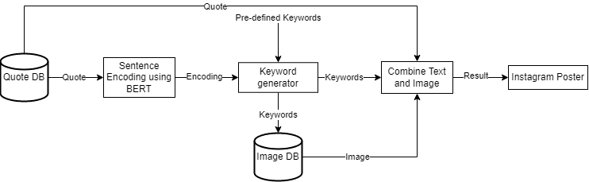
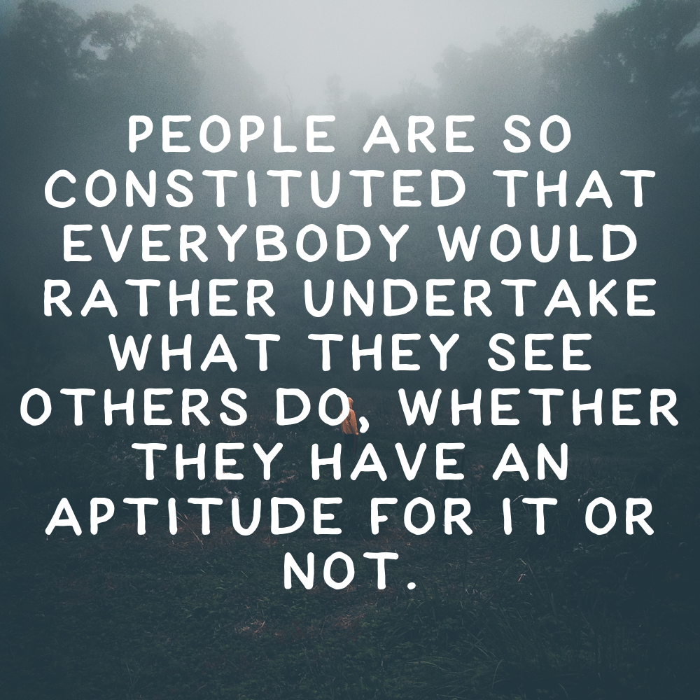

# How to generate images with motivational or inspirational quotes and post them to insta, automatically.
___
___
Repo for a little experiment to generate content for instagram and post it using motivational quotes and some AI.  
Its goal is not to seriously create content for instagram to make a channel famous, but rather a little experiement.
___
___
## Procedure

### 1. Get a motivational quote
As I am not really creative on a motivational level, it is clear that some quotes have to be generated or copied using external ressources.  
DONE: Found a file containing various quotes. Sufficient for now.  
Code in <code>quote.py</code>, Quotes in<code>quotes.txt</code>.

### 2. Get keywords matching the quote to use further on
Since I do not want to do any more than I have to in the process of actually creating images, some keywords have to be automatically generated using (probably) some kind of AI.  
DONE: Using sentence embedding (SBERT) to generate embeddings of the quote and the words inside. Top-X selection using cosine similarity.  
Code in <code>keywords.py</code>.

### 3. Get an image that can be used as background for the quote
Using the generated keywords (plus some pre-defined words like "nature"), find an image that can be used.  
DONE: Pexels offers images using an API with query and size filtering. Creators have to be named in the post though!  
Code in <code>image.py</code>.

### 4. Generate the image
Combine image and quote to create an image. Preferably square and readable quote.  
DONE: PIL+textwrap are powerfull!  
Code in <code>image.py</code>.

### 5. Identify hashtags
Using the quote, the keywords and the image, generate a list of hashtags matching the post.
DONE: See 2.

### 6. Post the result to instagram
Automate the procedure to post it to instagram. Account: **summa*removeme*limetta** (without "removeme")  
TODO: Find previous implementation or create new one.  
Code will be in <code>insta.py</code>  
___

# Examples:

  
  
  

  
  
  

  
  
  

